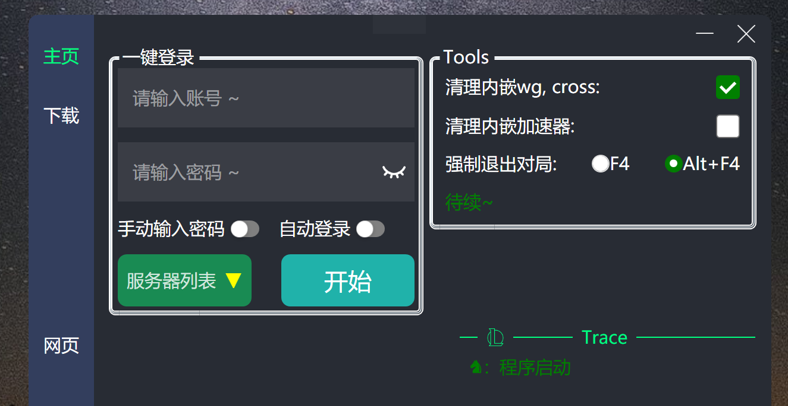

# LOLKit 点击右侧的Releases 下载

此项目涉及到账号密码安全问题，故而不开源

此项目涉及账号密码安全问题，故而没有开源. 不开源的原因, 开源后账户安全的不可控性;

自开发这个软件起, 账户的安全问题让作者焦头烂额, 自此有了三层安全层;
*	舍弃联网, 因而舍弃了绝大部分功能, 也限制了软件的拓展;
*	账户密码加密;
*	扫码登陆(v1.7.0);

*	Manual: https://sway.office.com/cC2rgXe3fIv2xmB4?play
*	视频演示:【合集·one gift for all lol gamers-哔哩哔哩】https://b23.tv/MFjZy2T
